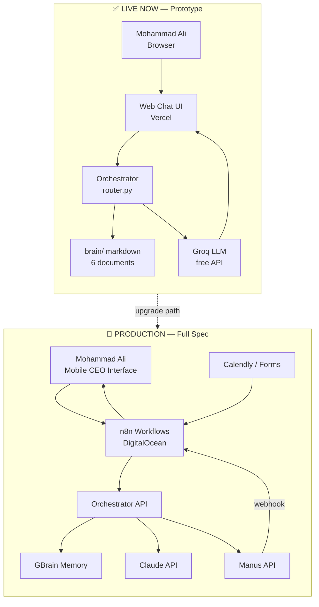
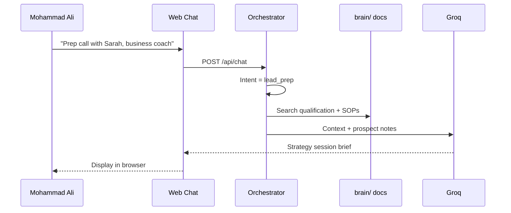
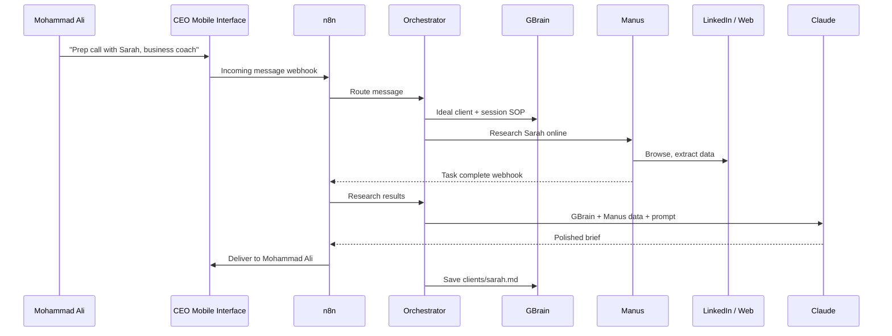
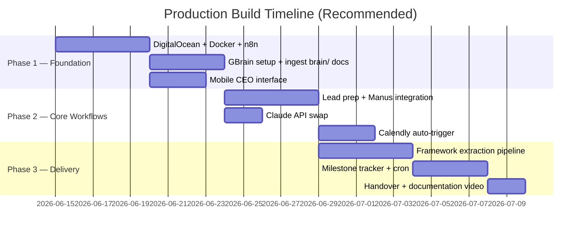

# Coaches Curve AI Orchestrator
## Prototype Demo & Production Roadmap

**Prepared for:** Mohammad Ali — Founder, The Coaches Curve / CEO's Little Helpers  
**Prepared by:** Sadiqullah Khan  
**Date:** June 2026  
**Live demo:** https://coaches-curve-orchestrator.vercel.app  
**Source code:** https://github.com/sadiqkhansks297/coaches-curve-orchestrator

---

## 1. Executive Summary

Mohammad Ali, this document accompanies your **live orchestrator prototype** — a working demonstration of the AI system described in your CEO's Little Helpers pre-screening brief.

**What exists today** is the **orchestration core**: a system that understands Coaches Curve business context, routes requests by intent, and returns grounded answers and strategy session briefs.

**What comes next** is the **production layer**: mobile CEO command interface, Manus autonomous research, GBrain persistent memory, Claude copywriting, n8n workflow automation, and DigitalOcean hosting — exactly as specified in your architecture requirements.

This is not a slide deck. It is a **functional prototype** you can open, test, and share — with a clear path from demo to production.

---

## 2. What You Can Do Right Now (Live Demo)

Open the demo and try these:

| Action | What happens |
|--------|--------------|
| Click **"Ideal client"** | Answers who Curve Concierge is for — from your knowledge base |
| Click **"Core problem"** | Explains non-transferable expertise — your core positioning |
| Click **"Lead prep brief"** | Generates a full strategy session briefing (Christine / Copenhagen example) |
| Type any question | System searches brain → Groq LLM → grounded response |

**This proves:** The orchestration model works. Your business knowledge drives the AI — not generic coaching advice.

---

## 3. Side-by-Side: Prototype vs Production

| Layer | ✅ Live Now (Prototype) | 🚀 Production (Your Full Spec) |
|-------|-------------------------|--------------------------------|
| **CEO interface** | Web chat UI (browser) | Mobile command interface — text/voice from your phone |
| **Hosting** | Vercel (serverless, free) | DigitalOcean Droplet — 24/7, portable, demoable to other CEOs |
| **Orchestrator** | `router.py` — intent routing | Same logic + Manus as primary task executor |
| **Memory / brain** | Local `brain/` markdown (6 docs) | **GBrain** — hybrid search, knowledge graph, client history |
| **Writing / copy** | Groq (free API) | **Claude API** — your voice, emails, briefs, nurture sequences |
| **Research / action** | LLM infers from context | **Manus API** — live LinkedIn/web research, multi-step tasks |
| **Workflow glue** | Direct API calls | **n8n** — webhooks, Calendly triggers, cron jobs, delivery |
| **Lead qualification** | Manual via chat | Auto on Calendly booking → Manus research → brief to your phone |
| **Framework extraction** | Not built | Concierge pipeline: call audio → framework → assets → GBrain |
| **Client milestones** | Not built | Daily cron → stalled Concierge clients → empathetic check-in drafts |
| **Password / access** | Open demo | Optional auth + CEO-only secured access |
| **Export / handoff** | GitHub repo | Docker Compose — one-command deploy per CEO client |

---

## 4. Architecture: Now vs Production

---

## 5. Workflow Comparison: Lead Prep Example

The highest-value use case for The Coaches Curve — preparing Mohammad Ali before a strategy session.

### Now (Prototype)

**Time saved:** Brief generated in ~5 seconds. No manual prep doc writing.

**Limitation:** No live web research on Sarah — LLM reasons from business knowledge + your notes only.

---

### Production (Full System)

**Additional value:** Live prospect research, persistent client memory, delivery to phone — no browser needed.

---

## 6. The Three Production Use Cases (Prioritised for Coaches Curve)

| Priority | Use case | Prototype status | Production build |
|----------|----------|------------------|------------------|
| **1** | Strategy session lead prep | ✅ Working in demo | + Manus research + mobile delivery |
| **2** | Framework extraction (Concierge) | ⏳ Not built | Call audio → framework stages → Claude → GBrain |
| **3** | Concierge milestone tracker | ⏳ Not built | Daily cron → stalled clients → check-in drafts |

All three map directly to Mohammad Ali's business: **Curve Concierge** delivery, **strategy sessions**, and **founder dependency reduction**.

---

## 7. What Stays the Same (No Rewrite Needed)

When moving to production, these components **carry over unchanged**:

- `brain/` content structure → migrates into GBrain
- `src/orchestrator/router.py` intent logic
- System prompts (`prompts.py`) — refined for Claude
- C.O.A.C.H.E.S. methodology framing
- Disqualification criteria + offer positioning

The prototype is not throwaway work. It is the **foundation** production builds on.

---

## 8. Production Deployment Roadmap

**Estimated total:** 4–6 weeks to full production per your spec.

---

## 9. What Sadiqullah Builds & Manages

| Responsibility | Prototype (done) | Production (next) |
|----------------|------------------|-------------------|
| Architecture design | ✅ | ✅ Ongoing |
| Knowledge base seeding | ✅ 6 core docs | Expand with full asset library |
| Orchestrator logic | ✅ | Add Manus + n8n routes |
| Web demo UI | ✅ | Mobile CEO interface as primary |
| Vercel deployment | ✅ | DigitalOcean Docker Compose |
| API integrations | Groq | Claude, Manus, GBrain, Calendly |
| Prompt engineering | ✅ Base prompts | Claude voice tuning for Mohammad Ali |
| Monitoring & optimization | — | Logs, token costs, weekly tweaks |
| CEO client template | — | Portable droplet for CEO's Little Helpers |

---

## 10. Tool Stack — Final Mapping

| Tool (Mohammad Ali's spec) | Role | Prototype stand-in | Production |
|----------------------------|------|-------------------|------------|
| **Manus** | Primary orchestrator + action arm | Orchestrator logic only | Manus API + webhooks |
| **Claude** | Copywriting + content | Groq (free) | Anthropic Claude API |
| **GBrain** | Knowledge + memory | `brain/` markdown | GBrain HTTP + MCP |
| **Mobile messaging layer** | CEO command interface | Web browser | n8n + messaging APIs |
| **n8n** | Workflow glue | Direct Python calls | Self-hosted on DO |
| **DigitalOcean** | Portable virtual hosting | Vercel serverless | Docker droplet |

---

## 11. Before / After — Mohammad Ali's Daily Experience

| Today (manual) | With production orchestrator |
|----------------|------------------------------|
| Manually research prospect before strategy call | Brief arrives on your phone before call |
| Explain C.O.A.C.H.E.S. from memory every sale | GBrain + assets pre-sell clarity |
| Write follow-up emails from scratch | Claude drafts in your voice — you approve |
| Track Concierge clients in head / scattered notes | GBrain flags stalled milestones daily |
| Repeat same explanations to every prospect | System answers from codified knowledge |
| Cannot demo system to other CEO clients | One DO droplet = portable template |

---

## 12. Links & Next Steps

| Resource | URL |
|----------|-----|
| **Live demo** | https://coaches-curve-orchestrator.vercel.app |
| **GitHub repo** | https://github.com/sadiqkhansks297/coaches-curve-orchestrator |
| **Architecture docs** | `docs/ARCHITECTURE.md` |
| **Production migration** | `docs/PRODUCTION_MIGRATION.md` |
| **Vercel deploy guide** | `docs/VERCEL_DEPLOY.md` |

### Recommended next step for Mohammad Ali

1. **Test the live demo** — try all three quick actions  
2. **20-minute call** — walk through architecture + production roadmap  
3. **Phase 1 kickoff** — DigitalOcean + Mobile interface + GBrain (Week 1)  

---

## 13. Closing

Mohammad Ali — this prototype demonstrates that the orchestration model for The Coaches Curve is **real and working today**. The knowledge layer, intent routing, and AI responses are live — not theoretical.

Production adds the interfaces and tools you specified (Manus, Claude, GBrain, n8n, DigitalOcean) around this proven core — so you can run Coaches Curve with less founder dependency, and CEO's Little Helpers can replicate the same system for every CEO client.

The foundation is built. The upgrade path is documented. Ready to proceed when you are.

---

*Sadiqullah Khan*  
*AI Solutions Architect & Implementation Engineer*
