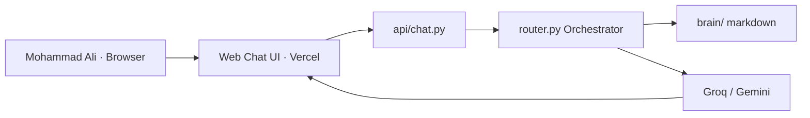
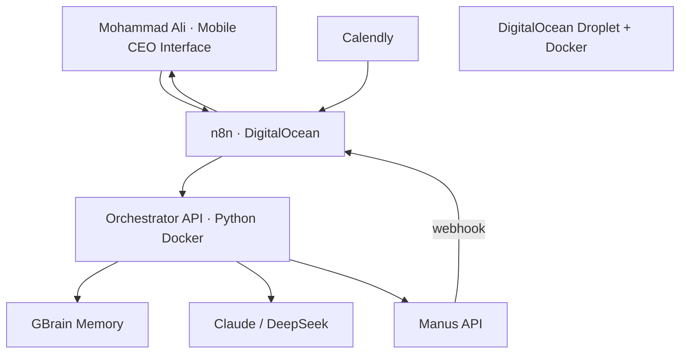

# PROJECT CONTEXT — Master Brief for LLMs

> **Purpose of this file:** Feed this entire document to any LLM (Claude, GPT, DeepSeek, Cursor, etc.) when starting a new chat with **no memory**. It contains every requirement, decision, architecture detail, client context, and project state for the Coaches Curve AI Orchestrator.

> **Last updated:** June 2026  
> **Owner / builder:** Sadiqullah Khan  
> **Client:** Mohammad Ali — Founder of The Coaches Curve & CEO's Little Helpers

---

## Table of Contents

1. [Who Is the Client & What Is the Opportunity](#1-who-is-the-client--what-is-the-opportunity)
2. [Original Pre-Screening Task Requirements](#2-original-pre-screening-task-requirements)
3. [The Coaches Curve Business (Must Understand This)](#3-the-coaches-curve-business-must-understand-this)
4. [What Has Been Built (Current State)](#4-what-has-been-built-current-state)
5. [Live URLs & Repository](#5-live-urls--repository)
6. [Project File Structure](#6-project-file-structure)
7. [Architecture — Prototype vs Production](#7-architecture--prototype-vs-production)
8. [Every Tool Explained & Its Role](#8-every-tool-explained--its-role)
9. [What Is the Orchestrator](#9-what-is-the-orchestrator)
10. [Top 3 Production Use Cases](#10-top-3-production-use-cases)
11. [LLM Provider Strategy](#11-llm-provider-strategy)
12. [Environment Variables](#12-environment-variables)
13. [How Code Works (Key Entry Points)](#13-how-code-works-key-entry-points)
14. [Production Build Roadmap & Timeline](#14-production-build-roadmap--timeline)
15. [Docker & DigitalOcean Explained](#15-docker--digitalocean-explained)
16. [Upwork / Client Communication Rules](#16-upwork--client-communication-rules)
17. [Git & Commit Conventions](#17-git--commit-conventions)
18. [Decisions Made During Development](#18-decisions-made-during-development)
19. [Client Messaging Templates](#19-client-messaging-templates)
20. [Common Q&A for Future LLM Sessions](#20-common-qa-for-future-llm-sessions)
21. [Related Documentation Files](#21-related-documentation-files)
22. [Instructions for Future LLMs](#22-instructions-for-future-llms)

---

## 1. Who Is the Client & What Is the Opportunity

| Field | Detail |
|-------|--------|
| **Client name** | Mohammad Ali (spell: Mohammad, not Muhammad, not Mo) |
| **Business 1** | The Coaches Curve — helps established experts escape "time-for-money trap" |
| **Business 2** | CEO's Little Helpers — bespoke AI orchestration service for CEOs |
| **Client website** | https://scalableassets.thecoachescurve.com/ |
| **CEO's Little Helpers** | https://www.ceoslittlehelpers.com |
| **Opportunity type** | Upwork pre-screening task → 20-min interview → potential ongoing engagement ($5K–$60K/mo per CEO's Little Helpers tiers) |
| **Builder** | Sadiqullah Khan — positioning as AI Solutions Architect & Implementation Engineer |

**What Mohammad Ali is evaluating:**
- Business understanding (not just tech)
- Ability to work with specified tools (or honesty about gaps)
- Clear structured communication
- Genuine excitement for the work

**This is NOT a paid task yet** — it's a 30–60 minute pre-screening exercise. Strong response → 20-minute Upwork call.

---

## 2. Original Pre-Screening Task Requirements

Mohammad Ali asked for a written proposal (1 page) or short Loom covering:

### 2.1 Orchestrator Architecture
- **Manus** as primary orchestrator (optionally n8n)
- System runs core operations: lead management, content, client communication, reporting

### 2.2 Tool Stack (all required — explain how each fits)
| Tool | Required role |
|------|---------------|
| **Manus** | Primary AI orchestrator + creative arm (images, video, research) |
| **Claude** | Copywriting, content creation, text-based tasks |
| **GBrain** | Knowledge base and memory layer |
| **TG or WA** | Primary CEO communication interface (instructions via message) |
| **DigitalOcean Droplet** | Fully virtual, portable, demonstrable hosting |

### 2.3 Top 3 Use Cases
- Specific to The Coaches Curve (reference the website)
- Highest time saved or value generated

### 2.4 Your Role
- What Sadiqullah builds, manages, maintains
- Timeline and approach

---

## 3. The Coaches Curve Business (Must Understand This)

### 3.1 Tagline
**"From Expert Labor To Asset Owner"** — escape the time-for-money trap.

### 3.2 Core Problem (NOT lead gen)
**Non-transferable expertise** — the client's method lives only in their head. Every sale depends on explaining it live. Revenue caps because growth = more founder exhaustion.

### 3.3 Who They Serve
Established coaches, consultants, therapists, educators, specialists with:
- Proven results and track record
- Revenue tied to personal hours/energy
- Method that changes every time they explain it

**NOT for:** beginners, unvalidated offers, "magic funnel" seekers.

### 3.4 The C.O.A.C.H.E.S. Curve (5-step OS)

| Step | Name | What it does |
|------|------|--------------|
| 1 | Positioning | Who you help, their language, your category |
| 2 | Asset Innovation | Framework, book, course, workshop deck |
| 3 | Revenue Architecture | Webinar, offer sheet, sales system |
| 4 | Operations | Onboarding SOPs, AI automation, reduce founder dependency 80–90% |
| 5 | Authority | Media kit, speaking, podcast strategy |

### 3.5 Offers

| Offer | Type | Client time |
|-------|------|-------------|
| **Curve Accelerator** | Done-with-you | More — client executes with guidance |
| **Curve Concierge** | Done-for-you | ~3 hours across 3 calls (Kickoff, Mid-Point, Final Delivery) |
| **Equity partnership** | 50/50 creator-publisher | After program completion + market traction |

### 3.6 Primary CTA
Free 30-minute **Strategy Session** — qualify established experts only.

### 3.7 Key Website Language to Reference
- "Codified certainty" vs "expert improvisation"
- "Non-transferable expertise"
- "Visible assets" — frameworks, offer sheets, diagnostic tools
- Testimonials: Rasmus Lindgren, Christine Sorensen, Brian Page

---

## 4. What Has Been Built (Current State)

### 4.1 Status Summary

| Component | Status |
|-----------|--------|
| Knowledge base (`brain/` — 6 markdown docs) | ✅ Done |
| Orchestrator (`router.py` — intent routing) | ✅ Done |
| LLM layer (Gemini + Groq, swappable) | ✅ Done |
| Web chat UI (premium design, animations, avatars) | ✅ Done |
| Vercel serverless API (`api/chat.py`) | ✅ Done |
| Live demo deployed | ✅ Done |
| Client handoff doc | ✅ Done |
| GitHub repo (clean, no Cursor co-author) | ✅ Done |
| Telegram / mobile interface | ❌ Not built |
| Manus integration | ❌ Not built |
| GBrain | ❌ Not built (local `brain/` stand-in) |
| n8n workflows | ❌ Not built |
| DigitalOcean production deploy | ❌ Not built |
| DeepSeek provider | ❌ Not built (architecture supports adding) |
| Claude provider | ❌ Not built (architecture supports adding) |

### 4.2 What the Demo Proves
- Orchestration model works
- Business knowledge drives AI (not generic coaching advice)
- Intent routing: `question` vs `lead_prep`
- Architecture is upgradeable without rewrite

### 4.3 What the Demo Does NOT Claim
- Full production system per Mohammad Ali's spec
- Manus live research
- Mobile CEO interface
- GBrain persistent memory

**Always frame as:** "Prototype of orchestrator core — production adds remaining tools."

---

## 5. Live URLs & Repository

| Resource | URL |
|----------|-----|
| **Live demo** | https://coaches-curve-orchestrator.vercel.app |
| **GitHub** | https://github.com/sadiqkhansks297/coaches-curve-orchestrator |
| **Vercel project** | sadiqkhansks297-7765s-projects/coaches-curve-orchestrator |

### 5.1 Secrets (NEVER commit to GitHub)
- `.env` is gitignored and in `.vercelignore`
- API keys go in Vercel dashboard env vars for production
- Current prototype uses **Groq** on Vercel
- Rotate API keys if ever shared in chat

---

## 6. Project File Structure

```
coaches-curve-orchestrator/
├── api/
│   ├── chat.py              # Vercel POST /api/chat — calls handle_message()
│   └── health.py            # GET /api/health — status check
├── brain/                   # Knowledge base (→ GBrain in production)
│   ├── methodology/coaches-curve-overview.md
│   ├── offers/curve-accelerator.md
│   ├── offers/curve-concierge.md
│   ├── sales/ideal-client-profile.md
│   ├── sales/objection-handling.md
│   └── sops/strategy-session-prep.md
├── docs/
│   ├── PROJECT_CONTEXT.md   # THIS FILE — master brief for LLMs
│   ├── CLIENT_HANDOFF.md    # Client-facing handoff doc
│   ├── ARCHITECTURE.md
│   ├── PRODUCTION_MIGRATION.md
│   ├── SETUP.md
│   └── VERCEL_DEPLOY.md
├── public/                  # Web chat UI
│   ├── index.html
│   ├── style.css
│   └── app.js
├── scripts/
│   └── test_demo.py         # Local verification script
├── src/
│   ├── config.py            # All env-based configuration
│   ├── knowledge/
│   │   ├── base.py          # KnowledgeStore interface
│   │   ├── local_store.py   # Prototype: markdown search
│   │   └── __init__.py      # Factory: get_knowledge_store()
│   ├── llm/
│   │   ├── base.py          # LLMProvider interface
│   │   ├── gemini.py
│   │   ├── groq.py
│   │   └── __init__.py      # Factory: get_llm_provider()
│   └── orchestrator/
│       ├── router.py        # MAIN ORCHESTRATOR — handle_message()
│       ├── prompts.py       # SYSTEM_PROMPT, LEAD_PREP_PROMPT
│       └── __init__.py
├── .env.example
├── .gitignore
├── .vercelignore
├── docker-compose.yml       # (to be created for production)
├── requirements.txt
├── runtime.txt
└── vercel.json
```

---

## 7. Architecture — Prototype vs Production

### 7.1 Prototype (Live Now)



### 7.2 Production (Full Spec)



### 7.3 Side-by-Side Table

| Layer | Prototype (now) | Production |
|-------|-----------------|------------|
| CEO interface | Web chat (browser) | Mobile command interface |
| Hosting | Vercel serverless | DigitalOcean Droplet + Docker |
| Orchestrator | `router.py` via `api/chat.py` | Same `router.py` in Python Docker container |
| Memory | `brain/` local markdown | GBrain |
| Writing | Groq (free) | Claude or DeepSeek |
| Research | LLM infers from context | Manus API |
| Workflows | Direct API calls | n8n webhooks + cron |
| Lead prep | Manual via chat | Auto on Calendly → Manus → brief |
| Concierge delivery | Not built | Framework extraction + milestones |
| CEO client template | GitHub repo | Clone Docker droplet per client |

---

## 8. Every Tool Explained & Its Role

### 8.1 Orchestrator (`router.py`)
- **What:** Decision brain — classifies intent, pulls context, calls tools, returns result
- **Prototype:** Python `handle_message()` on Vercel
- **Production:** Python API in Docker on DigitalOcean
- **NOT the same as Manus** — orchestrator coordinates; Manus executes complex tasks

### 8.2 n8n
- **What:** Workflow automation glue — webhooks, schedules, routing, delivery
- **Role:** WHEN something happens → route it to orchestrator → deliver result
- **NOT:** Creative AI, research, or decision-making
- **Analogy:** Office manager / receptionist

### 8.3 Manus
- **What:** Autonomous AI agent — browses web, researches, multi-step execution
- **Role:** Complex tasks (prospect research, asset production, analysis)
- **API:** https://open.manus.ai — webhooks on task completion
- **NOT:** Workflow glue (that's n8n)
- **Analogy:** Senior analyst who goes out and executes

### 8.4 GBrain
- **What:** Open-source knowledge/memory layer (Garry Tan, MIT license)
- **Role:** Persistent brain — frameworks, SOPs, client history, hybrid search + knowledge graph
- **Prototype stand-in:** `brain/` markdown + `LocalKnowledgeStore`
- **Production:** `gbrain serve --http` on DigitalOcean

### 8.5 Claude (Anthropic)
- **What:** Premium closed cloud LLM
- **Role per spec:** Copywriting, briefs, emails, nurture — in Mohammad Ali's voice
- **Cost:** Mid–high
- **NOT open-source** — cloud API only

### 8.6 DeepSeek
- **What:** Budget-friendly LLM with open-weight models
- **Role (proposed alternative):** Same writing slot as Claude at lower cost
- **With prompt tuning + GBrain:** Comparable to Claude for 80–90% of workflows
- **Honest claim:** "Comparable for most tasks" — NOT "always better than Claude"

### 8.7 Groq
- **What:** Fast free/cheap LLM API (Llama models)
- **Role:** Current prototype LLM on Vercel
- **Production:** Replaced by Claude or DeepSeek

### 8.8 Gemini
- **What:** Google AI Studio free tier
- **Role:** Alternative prototype LLM (quota issues encountered — Groq preferred)

### 8.9 DigitalOcean Droplet
- **What:** Virtual cloud server (rented computer, 24/7)
- **Role:** Production hosting — always on, portable, demoable to other CEOs
- **Cost:** ~$12–24/month recommended (2–4 GB RAM)
- **NOT a container** — it's the machine containers run ON

### 8.10 Docker
- **What:** Container platform — packages apps to run identically anywhere
- **Role:** Runs orchestrator + n8n + GBrain + Caddy on the droplet
- **One command:** `docker compose up -d`
- **CEO template:** Clone entire Docker stack for next client

### 8.11 Vercel
- **What:** Serverless hosting for demo
- **Role:** Client-facing prototype only — NOT production
- **Limitation:** 10–30s timeout, can't run n8n/GBrain/Manus alongside

### 8.12 Tool Relationship Summary

```
n8n       = WHEN & HOW (triggers, routing, delivery)
Manus     = DOES hard work (research, multi-step execution)
Orchestrator = DECIDES what to do (intent, coordination)
GBrain    = REMEMBERS (business knowledge, client history)
Claude/DeepSeek = WRITES (briefs, emails, copy)
Docker    = RUNS everything on the droplet
DO Droplet = WHERE it all lives (cloud computer)
```

---

## 9. What Is the Orchestrator

**One sentence:** The orchestrator receives Mohammad Ali's instruction, classifies intent, pulls knowledge context, routes to the right AI tools, and returns one coherent result.

**Entry point:** `src/orchestrator/router.py` → `handle_message(message: str) -> str`

**Flow:**
```
1. classify_intent(message)     → "question" | "lead_prep"
2. knowledge.search(query)      → business context from brain/
3. llm.generate(system, user)   → grounded response
4. (production) manus.run()    → if complex research needed
5. return reply
```

**Intents — prototype:**
- `question` — general business Q&A
- `lead_prep` — strategy session briefing (triggers on: prep, prepare, call with, meeting with, strategy session, brief)

**Intents — production (to add):**
- `framework_extract` — Concierge midpoint delivery
- `milestone_check` — stalled client tracking
- `draft_message` — follow-up emails

---

## 10. Top 3 Production Use Cases

### Use Case 1: Strategy Session Lead Prep (HIGHEST PRIORITY)
- **Trigger:** Mohammad Ali texts instruction OR Calendly booking
- **Flow:** n8n → orchestrator → GBrain (qualify) → Manus (research prospect) → Claude/DeepSeek (brief) → mobile delivery
- **Prototype status:** ✅ Working (without Manus research)
- **Value:** Brief before every call without manual research

### Use Case 2: Concierge Framework Extraction
- **Trigger:** Call audio/notes from Concierge kickoff or midpoint
- **Flow:** Transcribe → GBrain context → Claude/DeepSeek extract framework stages → store in GBrain
- **Prototype status:** ❌ Not built
- **Value:** Mirrors Concierge delivery — reduces founder dependency

### Use Case 3: Concierge Milestone Tracker
- **Trigger:** Daily cron (8am)
- **Flow:** n8n → GBrain (scan stalled clients) → Claude/DeepSeek (check-in draft) → Mohammad Ali approves → send
- **Prototype status:** ❌ Not built
- **Value:** No client falls through cracks on Accelerator/Concierge delivery

---

## 11. LLM Provider Strategy

### 11.1 Swappable Architecture
All LLMs implement `LLMProvider.generate(system, user) -> str`. Change via `.env`:
```env
LLM_PROVIDER=groq|gemini|claude|deepseek
```

### 11.2 Provider Comparison

| Provider | Cost | Best for | Status in project |
|----------|------|----------|-------------------|
| Groq | Free/cheap | Prototype, fast inference | ✅ Built |
| Gemini | Free tier | Prototype alternative | ✅ Built (quota issues) |
| DeepSeek | Very cheap | Production budget option | ❌ To add |
| Claude | Mid–high | Premium CEO voice (per spec) | ❌ To add |
| OpenAI GPT | Mid–high | Alternative if client has credits | ❌ Not built |

### 11.3 Recommendation for Mohammad Ali
> "DeepSeek for budget-friendly day-to-day tasks (with prompt tuning + GBrain, comparable results for most workflows); Claude per your spec for premium client-facing copy where voice precision matters most. Both plug into the same system."

### 11.4 OpenAI vs DeepSeek vs Claude — Client FAQ
- All are **cloud APIs** — none are fully private unless self-hosted
- DeepSeek has **open-weight models** but API is still hosted
- Claude is **closed/proprietary** — not "private AI" in the self-hosted sense
- For orchestration tasks (briefs, Q&A): DeepSeek + prompts ≈ Claude for 80–90% of cases

---

## 12. Environment Variables

See `.env.example` for full list. Key variables:

```env
# LLM (pick one)
LLM_PROVIDER=groq
GROQ_API_KEY=
GROQ_MODEL=llama-3.3-70b-versatile
GEMINI_API_KEY=
GEMINI_MODEL=gemini-2.0-flash-lite

# Knowledge
KNOWLEDGE_PROVIDER=local
BRAIN_DIR=brain

# Vercel demo (optional)
DEMO_PASSWORD=

# Production (not needed for prototype)
ANTHROPIC_API_KEY=
MANUS_API_KEY=
GBRAIN_URL=
GBRAIN_TOKEN=
TELEGRAM_BOT_TOKEN=
```

**CRITICAL:** Never commit `.env` to GitHub. Never paste API keys in Upwork messages.

---

## 13. How Code Works (Key Entry Points)

### 13.1 User sends message (web demo)
```
public/app.js → POST /api/chat → api/chat.py → handle_message() → JSON reply
```

### 13.2 Orchestrator logic
```python
# src/orchestrator/router.py
handle_message(message)
  → classify_intent(message)        # question | lead_prep
  → get_knowledge_store().search()  # brain/ context
  → get_llm_provider().generate()   # Groq/Gemini/Claude/DeepSeek
  → return str
```

### 13.3 Knowledge layer
```python
# src/knowledge/local_store.py (prototype)
LocalKnowledgeStore.search(query) → relevant markdown chunks as string
# Production: GBrainStore → gbrain MCP/HTTP API
```

### 13.4 LLM layer
```python
# src/llm/groq.py or gemini.py
LLMProvider.generate(system_prompt, user_prompt) → str
```

### 13.5 Local testing
```bash
source .venv/bin/activate
python scripts/test_demo.py                  # full test
python scripts/test_demo.py --knowledge-only # no API key needed
```

### 13.6 Production entry (to build)
```python
# FastAPI/Flask wrapper on DigitalOcean
POST /message → handle_message() → JSON
# Called by n8n webhooks
```

---

## 14. Production Build Roadmap & Timeline

### 14.1 Phases

| Phase | Weeks | Deliverable |
|-------|-------|-------------|
| **Phase 1: Foundation** | 1–2 | DO droplet + Docker + n8n + mobile interface + GBrain |
| **Phase 2: Core workflows** | 3–4 | Lead prep + Manus + Claude/DeepSeek + Calendly |
| **Phase 3: Delivery** | 5–6 | Framework extraction + milestone tracker + CEO template |

**Total:** 4–6 weeks part-time (15–20 hrs/week) OR 3–4 weeks full-time

### 14.2 Week-by-Week

| Week | Tasks |
|------|-------|
| 1 | DigitalOcean, Docker, Caddy SSL, n8n, mobile CEO interface |
| 2 | GBrain setup, ingest brain/ docs, Claude/DeepSeek swap, lead prep live |
| 3 | Manus API + webhooks, live prospect research |
| 4 | Framework extraction pipeline (Concierge) |
| 5 | Milestone tracker, cron jobs |
| 6 | Polish, monitoring, CEO client template, handover video |

### 14.3 What Carries Over Unchanged
- `brain/` content → migrates to GBrain
- `src/orchestrator/router.py` intent logic
- `src/orchestrator/prompts.py`
- Project folder structure
- Swappable provider architecture

---

## 15. Docker & DigitalOcean Explained

```
DigitalOcean Droplet = cloud computer (the building)
Docker               = container manager on that computer
Containers           = individual apps (orchestrator, n8n, gbrain, caddy)
```

**Production deploy:**
```bash
# On DigitalOcean droplet
git clone https://github.com/sadiqkhansks297/coaches-curve-orchestrator
docker compose up -d
```

**docker-compose.yml (to create) will include:**
- `orchestrator-api` (Python — runs router.py)
- `n8n`
- `gbrain` + `postgres`
- `caddy` (HTTPS)

---

## 16. Upwork / Client Communication Rules

### 16.1 Words to AVOID in Upwork messages (before contract)
- Telegram, WhatsApp, Slack, Discord
- Personal email addresses
- Phone numbers
- External messaging platform names

### 16.2 Safe alternatives
| Avoid | Use instead |
|-------|-------------|
| Telegram / WhatsApp | "mobile CEO command interface" |
| Brief to Telegram | "brief to your phone" |
| Telegram bot | "mobile CEO interface" |

### 16.3 Tone for Mohammad Ali
- Professional, confident — NOT "desperate" or needy
- Frame prototype honestly — not full production
- Show business understanding first, tech second
- Reference C.O.A.C.H.E.S. language from website

### 16.4 Closing line style
> "I'm genuinely excited about this work and look forward to building this with you."

NOT: "I am desperate to work with you."

---

## 17. Git & Commit Conventions

### 17.1 Critical Rule
**Cursor IDE auto-adds `Co-authored-by: Cursor <cursoragent@cursor.com>` to commits.**

For client-facing repos:
1. Commit from terminal, OR
2. Use `git commit-tree` to bypass the hook:
```bash
TREE=$(git rev-parse 'HEAD^{tree}')
NEW=$(git commit-tree "$TREE" -F - <<'EOF'
Your commit message here
EOF
)
git reset --hard "$NEW"
```

### 17.2 Current Git State
- Single clean commit on `main`
- Author: Sadiqullah Khan only
- No Cursor co-author in history
- `.env` gitignored

---

## 18. Decisions Made During Development

| Decision | Reason |
|----------|--------|
| Start with local `brain/` not GBrain | No Bun/GBrain install needed for prototype |
| Use Groq over Gemini on Vercel | Gemini free tier quota limit: 0 |
| Web UI over Telegram for demo | Upwork blocks messaging platform names; faster to demo |
| Vercel for prototype, DO for production | Serverless can't run n8n+GBrain+Manus together |
| Swappable provider interfaces | Easy upgrade to Claude/DeepSeek/GBrain without rewrite |
| Remove DEMO_PASSWORD from Vercel | Client friction; `.env` was leaking via build cache |
| Single squashed git commit | Remove Cursor co-author from all history |
| Use "Mohammad Ali" not "Muhammad" or "Mo" | Client preference |
| Avoid Telegram/WhatsApp in CLIENT_HANDOFF.md | Upwork-safe screenshots |
| Premium UI redesign | Client impression for demo |
| DeepSeek as budget LLM option | Cost efficiency for Mohammad Ali |

---

## 19. Client Messaging Templates

### 19.1 Upwork Submission (safe version)
```
Hi Mohammad Ali,

I've completed the pre-screening prototype for The Coaches Curve orchestrator:

Live demo: https://coaches-curve-orchestrator.vercel.app
Code + roadmap: https://github.com/sadiqkhansks297/coaches-curve-orchestrator

Try the three quick actions — especially "Lead prep brief."

Full architecture comparison and production timeline are in
docs/CLIENT_HANDOFF.md on the repo.

Happy to walk through it on a call.

Best,
Sadiqullah Khan
```

### 19.2 LLM Provider Pitch
```
For the language model, we can deploy DeepSeek as a budget-friendly,
capable option for day-to-day orchestration tasks, or Claude as
specified in your architecture for premium client-facing copy — both
plug into the same system. With careful prompt tuning and your
business context from GBrain, DeepSeek can deliver comparable results
to Claude for most workflows.
```

### 19.3 Prototype vs Production Framing
```
This is a working prototype of the orchestrator core — production adds
your full stack (Manus, GBrain, Claude/DeepSeek, n8n, and mobile
CEO interface) on DigitalOcean, per your architecture spec.
```

---

## 20. Common Q&A for Future LLM Sessions

**Q: Is this production-ready?**  
A: No. It's a working prototype demo. Production adds Manus, GBrain, n8n, mobile interface, DigitalOcean.

**Q: What runs the orchestrator in production?**  
A: `router.py` wrapped in a Python API (FastAPI/Flask) in a Docker container on a DigitalOcean droplet. n8n forwards requests to it.

**Q: What's the difference between n8n and Manus?**  
A: n8n = workflow glue (when/triggers/delivery). Manus = autonomous execution (research/multi-step tasks).

**Q: What's the difference between Docker and DigitalOcean?**  
A: DO Droplet = the cloud computer. Docker = how apps run on that computer in containers.

**Q: Can DeepSeek replace Claude?**  
A: For 80–90% of tasks yes, with prompt tuning. Claude still better for premium CEO-voice copy out of the box.

**Q: Why was Upwork message blocked?**  
A: Mentioned Telegram/WhatsApp — Upwork blocks external messaging platform references before contract.

**Q: What's the next build step?**  
A: Phase 1 production — DigitalOcean + Docker + n8n + GBrain + mobile CEO interface.

**Q: Who is the client?**  
A: Mohammad Ali — The Coaches Curve & CEO's Little Helpers.

**Q: What must LLMs never do in this repo?**  
A: Commit `.env` secrets; add Cursor co-author to git; mention Telegram/WhatsApp in client-facing Upwork messages; claim prototype is full production.

---

## 21. Related Documentation Files

| File | Purpose |
|------|---------|
| `docs/PROJECT_CONTEXT.md` | **THIS FILE** — master LLM brief |
| `docs/CLIENT_HANDOFF.md` | Client-facing handoff (Upwork-safe wording) |
| `docs/ARCHITECTURE.md` | Technical architecture |
| `docs/PRODUCTION_MIGRATION.md` | Component swap guide |
| `docs/SETUP.md` | Local install guide |
| `docs/VERCEL_DEPLOY.md` | Vercel deployment guide |
| `README.md` | Project overview |

---

## 22. Instructions for Future LLMs

When you read this file, you should:

1. **Understand the client is Mohammad Ali** — Coaches Curve + CEO's Little Helpers
2. **Understand the business problem** — non-transferable expertise, not lead gen
3. **Know what's built** — orchestrator core + web demo on Vercel (prototype only)
4. **Know what's NOT built** — Manus, GBrain, n8n, DO production, mobile interface
5. **Preserve swappable architecture** — don't hardcode providers; use interfaces in `src/`
6. **Match existing code style** — read surrounding files before editing
7. **Never commit secrets** — `.env` stays gitignored
8. **Never add Cursor co-author** to git commits on this repo
9. **Use Upwork-safe language** in client-facing docs (no Telegram/WhatsApp)
10. **Be honest about prototype vs production** — don't oversell

### Priority if asked to continue building:
1. DigitalOcean + Docker Compose + orchestrator API
2. GBrain integration (`src/knowledge/gbrain_store.py`)
3. n8n workflows
4. Mobile CEO interface
5. Manus client (`src/agents/manus_client.py`)
6. Claude/DeepSeek providers
7. Framework extraction + milestone tracker use cases

### Key files to read first in any new session:
1. `docs/PROJECT_CONTEXT.md` (this file)
2. `src/orchestrator/router.py`
3. `src/orchestrator/prompts.py`
4. `brain/` (all markdown files)
5. `src/config.py`

---

*End of PROJECT_CONTEXT.md — Sadiqullah Khan — Coaches Curve AI Orchestrator — June 2026*
